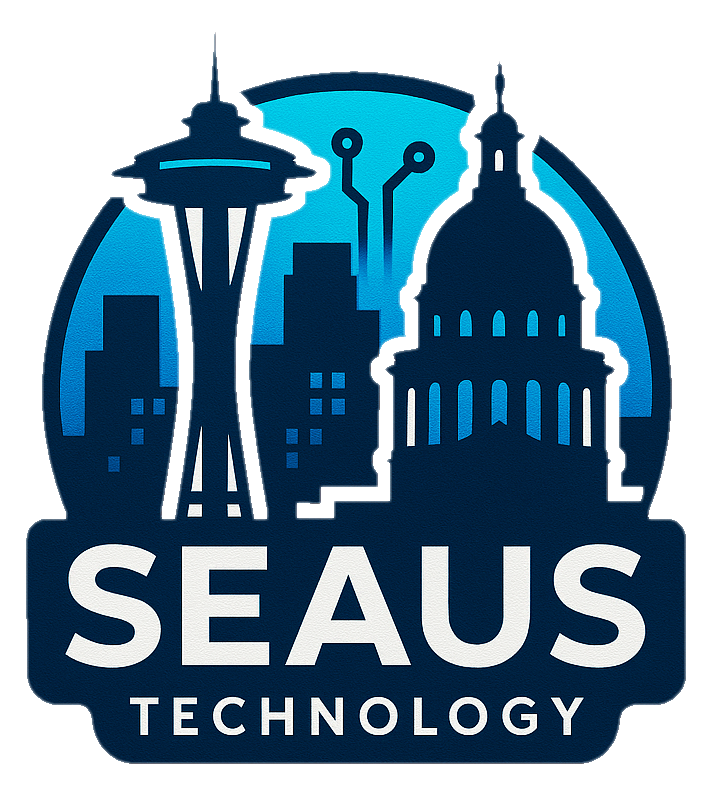

# Seaus Tech

  

  <strong>Crafting premium developer utilities, cross-platform apps, and hyper-optimized systems.</strong>

  
  
  
  
  
  

---

## 🌌 Who We Are

Seaus Tech is an independent software engineering studio. We build clean, highly responsive, and useful software for macOS, iOS, the web, and the terminal. We are passionate about developer experience, low-latency applications, and premium user interface designs.

---

## 🛠️ Our Projects

### 💻 Developer Tools & Utilities

| Project | Tech Stack | Description |
| :--- | :--- | :--- |
| [**Aurora Shell**](https://github.com/Seaus-tech/Aurora-Shell) | `Zsh` `PowerShell` `Shell` | A sleek, high-performance terminal theme and diagnostic dashboard for macOS and Windows. |
| [**Gemini Xcode Proxy**](https://github.com/Seaus-tech/GeminiXcodeProxy) | `JavaScript` `Wrangler` `CF Workers` | A lightweight proxy translating OpenAI-formatted completion/chat requests from Xcode to Gemini API. |
| [**macOS Exe Runner**](https://github.com/Seaus-Tech/MacOS-exe-runner) | `SwiftUI` `Wine` `AI Engine` | A native macOS wrapper that runs Windows `.exe` executables natively via Wine, with built-in AI help. |
| [**FreeUp**](https://github.com/Seaus-tech/FreeUp) | `SwiftUI` `macOS` | A one-click macOS disk utility to scan, locate, and clean system junk files safely. |

### 🎮 Native Gaming & Engine Ports

| Project | Tech Stack | Description |
| :--- | :--- | :--- |
| [**NEO-GRID Tic-Tac-Toe**](https://github.com/Seaus-tech/TicTacToe) | `SwiftUI` `Node.js` `WebSockets` | A futuristic, neon-styled multiplatform game (iOS, macOS, tvOS, visionOS) with custom WebSocket multiplayer. |
| [**Pac-Man 256 (iOS)**](https://github.com/Seaus-tech/PACMAN-256) | `SwiftUI` `SpriteKit` `AVFoundation` | Native Swift endless scrolling arcade game featuring synthetic retro chiptune audio generated in real time. |
| [**pacman.c**](https://github.com/Seaus-tech/PACMAN-C) | `C99` `Sokol` `WASM` | Portable, minimal-dependency Pacman clone compilation-ready for desktop and WebAssembly. |
| [**pacman.zig**](https://github.com/Seaus-tech/PACMAN-ZIG) | `Zig` `Sokol` `WASM` | High-fidelity port of `pacman.c` to Zig, maintaining lightweight, zero-dependency builds. |
| [**pacman256.c**](https://github.com/Seaus-tech/PACMAN256-C) | `C99` `Sokol` | Pac-Man 256 endless maze generator and game logic written completely in standard C. |

### 📱 Connectivity, Productivity & Client Replications

| Project | Tech Stack | Description |
| :--- | :--- | :--- |
| [**SeatX**](https://github.com/seaus-tech/SeatX) | `SwiftUI` `CoreBluetooth` | Connected automotive telemetry dashboard and proximity smart-key manager for EV & ICE vehicles. |
| [**Seaus Assigned**](https://github.com/Seaus-Tech/Seaus-Assigned) | `SwiftUI` `watchOS` `tvOS` | Cross-device homework and classroom assignment tracker integrated with the EdClub/TypingClub APIs. |
| [**Microsoft Chat Replicated**](https://github.com/seaus-tech/Microsoft-chat) | `React` `Tauri` `TypeScript` | A high-fidelity desktop replication client of Microsoft Teams using modern web frameworks. |
| [**Calculator App**](https://github.com/Seaus-tech/Calculator-app) | `Python` `Ply` | Natural language parsing, fraction-aware desktop calculator with meme modes and word-problem solver. |

---

## ⚡ Core Tech Focus

- **Apple Ecosystem:** SwiftUI, SpriteKit, CoreBluetooth, Swift Concurrency, Catalyst, and Multiplatform (iOS, macOS, watchOS, tvOS, visionOS).
- **System Languages & WASM:** C99, Zig, and Rust with Sokol/WebAssembly deployment.
- **Web & Cloud Workers:** React, Tauri, TypeScript, Cloudflare Workers, Node.js WebSockets, and serverless architectures.

---

  © 2026 Seaus Tech. All rights reserved.

